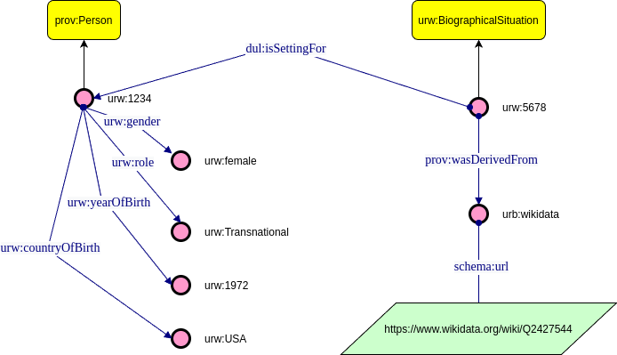

### The Google form where you can submit information

<iframe src="https://docs.google.com/forms/d/e/1FAIpQLScuNf-tGRyeE-cRziHXK3HvjZcIz9-Jc3f9edOanvaKUkdhxw/viewform?embedded=true" width="640" height="824" frameborder="0" marginheight="0" marginwidth="0">Caricamento…</iframe>

### Snapshot of the expected KG in turtle syntax
<blockquote>
urw:1234 a prov:Person; 
&nbsp;&nbsp;&nbsp;&nbsp; rdfs:label 'Nora Keita Jemisin'; 
&nbsp;&nbsp;&nbsp;&nbsp;    urw:gender urw:female; 
&nbsp;&nbsp;&nbsp;&nbsp;    dul:hasRole urw:Transnational; 
&nbsp;&nbsp;&nbsp;&nbsp;    urw:yearOfBirth urw:1972; 
&nbsp;&nbsp;&nbsp;&nbsp;    urw:countryOfBirth urw:USA . 

urw:5678 a urw:BiographicalSituation ; 
&nbsp;&nbsp;&nbsp;&nbsp;    dul:isSettingFor urw:USA , urw:1972 , urw:Transnational , urw:female , urw:artist1234 ; 
&nbsp;&nbsp;&nbsp;&nbsp;    prov:wasDerivedFrom urb:wikidata 
    
urb:wikidata  schema:url  "https://www.wikidata.org/wiki/Q2427544" . 
</blockquote>

### Graphical representation of the KG snapshot 

