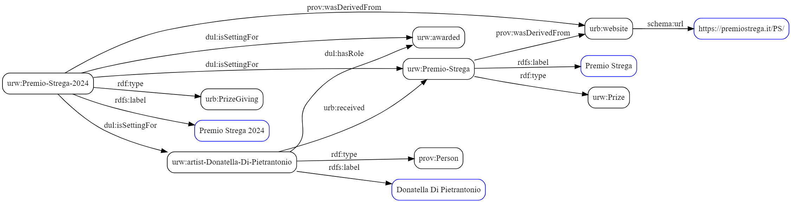

## CSV to KG

Starting with the data entered from the Google form below, the information obtained must be passed to the file `prize_run.py` which generates the KG using `sparql-anything`. This pipiline does not handle the entry of books or authors it is assumed that a script used before `prize_run.py` takes care of retrieving the information and thus the entities associated with the awarded book and author.

### The Google form where you can submit information

[Add prize information of an author](https://docs.google.com/forms/d/e/1FAIpQLSezTCh63IDVMit2qQaqN8rpEFHQwq8zrm7nC6XD22s_S0Pi2g/viewform?usp=sharing)

### Snapshot of the expected KG in turtle syntax
<blockquote>
urw:Premio-Strega  rdf:type  urw:Prize ;  
&nbsp;&nbsp;&nbsp;&nbsp;    rdfs:label           "Premio Strega" ;  
&nbsp;&nbsp;&nbsp;&nbsp;    prov:wasDerivedFrom  urb:website .  

urw:Premio-Strega-2024      rdf:type             urb:PrizeGiving ;  
&nbsp;&nbsp;&nbsp;&nbsp;    rdfs:label           "Premio Strega 2024" ;  
&nbsp;&nbsp;&nbsp;&nbsp;    dul:isSettingFor     urw:awarded , urw:artist-Donatella-Di-Pietrantonio , urw:Premio-Strega ;  
&nbsp;&nbsp;&nbsp;&nbsp;    prov:wasDerivedFrom  urb:website .  

urb:website  schema:url  "https://premiostrega.it/PS/" .  

urw:artist-Donatella-Di-Pietrantonio    rdf:type      prov:Person ;  
&nbsp;&nbsp;&nbsp;&nbsp;    rdfs:label    "Donatella Di Pietrantonio" ;  
&nbsp;&nbsp;&nbsp;&nbsp;    urb:received  urw:Premio-Strega ;  
&nbsp;&nbsp;&nbsp;&nbsp;    dul:hasRole   urw:awarded .  
</blockquote>

### Graphical representation of the KG snapshot 

